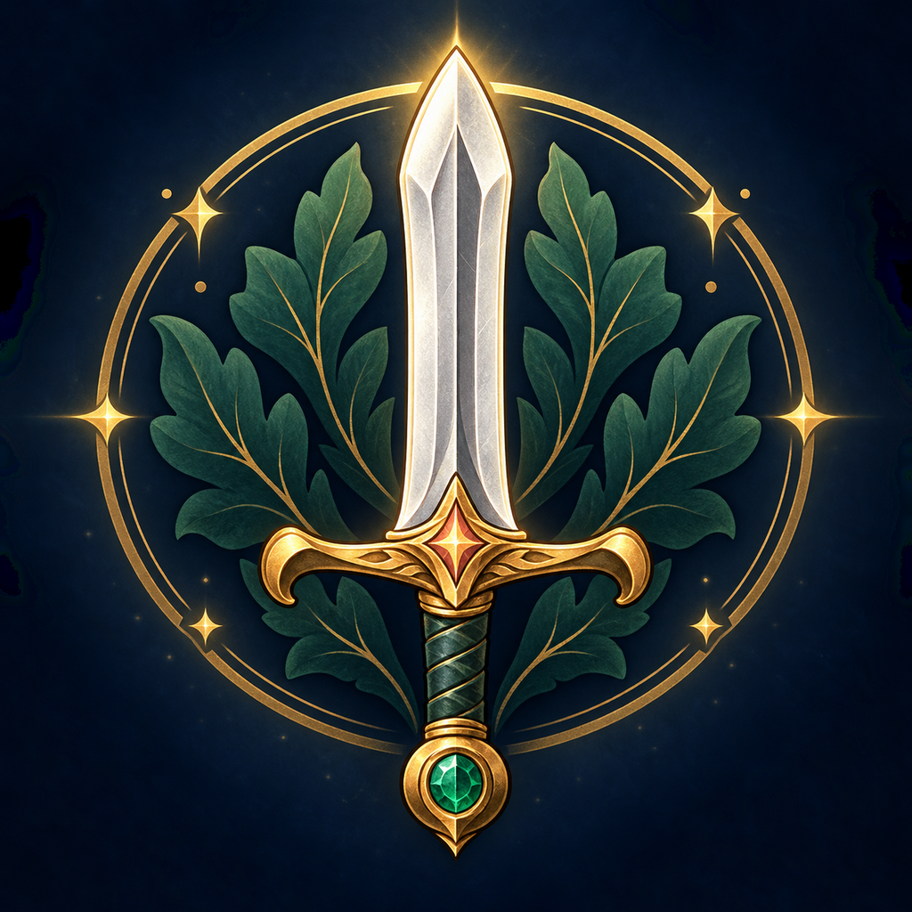

# ADHD Warrior for Windows

ADHD Warrior is a private, local-first Windows desktop app that turns everyday tasks into a gentle fantasy progression loop. Capture a task, break it into small steps, complete it for XP and coins, grow a familiar, collect equipment, and damage a weekly boss. The design favors clear next actions and encouraging feedback over pressure.




## Current release

**Windows preview 0.22.1 · save format 12 · .NET Framework 4.8**

This repository is the native C# Windows migration of the more complete iOS app. The iOS implementation is the behavioral source of truth whenever a matching Windows feature is added. The Android port and preserved artwork are secondary references.

### Working features

- Quick capture and detailed quest editing.
- School, Work, Home, Life, and Fun categories.
- Optional due dates and times, substeps, archive/restore, search, and bulk actions.
- Daily and weekly recurring quests.
- iOS-style daily quest templates with weekday schedules, time-of-day labels, pause controls, and duplicate-safe daily generation.
- Common, Uncommon, Rare, Epic, and Unique rarities with iOS XP defaults.
- iOS character level thresholds and visible progress toward the next level.
- Dedicated daily, weekly, monthly, and weekday streak quests with editing, next-eligible dates, guarded removal, and current/best history.
- Optional Windows notifications with sign-in startup, close-to-tray background mode, separate quest/streak switches, a daily reminder time, quiet hours, aggregation, and duplicate suppression.
- Read-only Google Calendar and Microsoft 365/Outlook linking through private or published ICS addresses, with separate encrypted local links, duplicate-safe manual imports, and selectable quest category.
- Google public-feed 404 errors explain that public addresses require a public calendar and direct the user to Google’s private Secret address instead.
- Four familiar families: Silent Basilisk, Arcane Drake, Storm Gryphon, and Wild Hydra.
- Familiar hatching, leveling, evolution, skill points, Quest XP, Streak XP, and Loot Chance.
- Local character display names, custom familiar names, and nine sequential iOS avatar journeys.
- A nine-panel character portrait that starts with the Standard hood and face visible, then reveals each remaining panel as its matching gear slot is earned or purchased.
- Eighteen weekly bosses with quest damage, rollover healing, history, and rewards.
- An iOS-style quest-completion popup showing the current boss artwork, damage dealt, remaining health, victory, and next encounter.
- Visual completion rewards for coins, familiar XP or egg growth, and every equipment drop, using familiar and equipment artwork from the game.
- All 81 iOS equipment definitions, nine visual avatar sets, cosmetic collection progress, and a coin shop.
- A large iOS-style character paper doll with full-height avatar art and owned or locked equipment arranged in two visual rails.
- Rarity-weighted bonus loot based on the iOS drop tables.
- Automatically claimed consistency rewards at 3, 7, 14, 30, and 60 total completions.
- Sequential gear rewards: Standard fills first, then Archanist, Garden Gnome, Wood Elf, Micah, Stacy, Spellbinder, Sunforge, and Moonveil.
- Twilight forest theme with buffered page rendering.
- A dedicated sword-and-forest application emblem embedded into the executable, installer, window, notification area, and generated shortcuts.
- Atomic local saves, previous-save recovery, Windows backup/restore, and reviewed partial iOS import.

### Screens

The left navigation contains Today, All quests, Review, Daily templates, Streak quests, Character, Familiars, Boss map, Equipment, Rewards, Completed, Archive, and Settings. Settings contains linked calendars, reminders, backup/restore, and iOS import controls.

## Run the app

On the development machine, close any older ADHD Warrior window and open `Launch ADHD Warrior.lnk`. The launcher points to `dist/0.22.1/ADHD Warrior.exe`.

Build output and the local shortcut are intentionally excluded from Git. A fresh clone must be built before it can run:

```powershell
powershell -NoProfile -ExecutionPolicy Bypass -File .\build.ps1
```

The build uses the Windows .NET Framework compiler already included with Windows and downloads no packages. Keep the generated `assets` folder and `.config` file beside the executable.

## Install or uninstall

Build the per-user installer with:

```powershell
powershell -NoProfile -ExecutionPolicy Bypass -File .\build-installer.ps1
```

Run `build-release.ps1` to create the setup executable, portable ZIP, and `SHA256SUMS.txt` under `release/0.22.1/`. The app and installer embed Windows compatibility manifests for per-user execution, Windows 10/11 recognition, per-monitor DPI awareness, and long-path awareness. The installer places the app under `%LOCALAPPDATA%\Programs\ADHD Warrior`, creates Start menu and desktop shortcuts, and registers a clean uninstall entry in Windows Apps & Features. Upgrades preserve `%LOCALAPPDATA%\AdhdWarrior\save.json` and its backups.

## Saves and privacy

Normal progress is stored at:

```text
%LOCALAPPDATA%\AdhdWarrior\save.json
```

Writes are atomic. The prior file is retained as `save.json.bak`. Windows save formats 1–11 migrate to format 12 when loaded and are written in the new format after the next successful change. Startup, background, and calendar linking default off. Invalid or unsupported saves stop loading before the original is overwritten.

The app requires no account. Calendar linking is optional; when the user requests a sync, the app downloads the linked Google or Microsoft 365 calendar feed directly and creates local quests. Calendar addresses are encrypted with Windows account protection in Local AppData, excluded from backups, and never committed. Personal saves, backups, build output, shortcuts, and test state are excluded from Git.

## iOS migration

Use **Settings → Preview iOS import** and review the report before applying it. Applying an import first creates a timestamped recovery copy of the Windows state. The source export is never modified.

The importer currently carries over:

- Quest identity, title, category, rarity, XP, due date/time, completion, substeps, backlog/archive state, and supported recurrence.
- Streak quests, cadence, XP, total completions, current/best streaks, and last completion date.
- Daily templates, their schedules and generation preference, compatible equipment rewards, and claimed consistency milestones. Imported pending gear is automatically redirected into the current avatar journey.
- Lifetime XP, coins, and distinct known equipment.
- Compatible hatched familiars, skill allocations, selected familiar, and growing eggs at stages 1–3.
- Character display name, compatible unlocked avatar selection, and familiar names.
- Compatible current weekly boss state and up to 30 dated boss-history entries.

Known migration limits include duplicate or unsupported familiar families, exact mobile evolution stages, stage-4 ready eggs, duplicate inventory quantities, unsupported or duplicate reward items, calendar links, friends, other settings, and Apple integrations. Keep the original iOS export.

## Architecture

This is a dependency-free Windows Forms application targeting .NET Framework 4.8.

| Area | Main files |
| --- | --- |
| Application shell and quest pages | `src/App.cs` |
| Quest/save model and persistence | `src/Core.cs` |
| Familiar, equipment, and boss rules | `src/Journey.cs`, `src/GearCatalog.cs` |
| Adventure pages | `src/JourneyViews.cs` |
| Streak model, rules, and page | `src/Streaks.cs` |
| Daily templates and automatic milestone rewards | `src/DailyTemplates.cs` |
| Character and familiar identity | `src/Identity.cs` |
| iOS JSON preview/import | `src/IosImport.cs` |
| Visual system and repaint buffering | `src/Theme.cs` |
| Quest editor | `src/Editor.cs` |
| Portable build | `build.ps1`, `AdhdWarrior.Windows.csproj` |
| Installer and release packaging | `build-installer.ps1`, `installer/Installer.cs` |
| Mobile references | `reference/` |

The build script compiles every `src/*.cs` and `tests/*.cs` file into one executable and copies runtime artwork. `generate-ios-catalog.ps1` regenerates the equipment catalog from the preserved Swift models.

## Validation status

Version 0.22.1 passes **152 automated assertions** covering sequential current-set rewards, automatic claiming, avatar advancement, cosmetic equipment boundaries, the embedded Windows icon, core quest/adventure behavior, calendars, templates, identity, reminders, migrations, and iOS import boundaries. Quest pages now use rounded poker-card tiles that reflow into columns as the window resizes, with the current boss and active familiar artwork plus total XP, familiar loot chance, and familiar growth or XP rewards. Sprite-sheet tiles use proportional, inset crops that remove painted gutters, and locked character sections use overlapping masks without drawn grid borders. Page rebuilding now suppresses intermediate redraws and commits one buffered repaint to prevent the forest background from flashing during menu changes. Successful live calendar feeds, Windows icon-cache refresh, sign-in startup, tray interaction, notification delivery, shortcuts, Apps & Features UI, completion-dialog scaling, export/restore dialogs, and varied display scaling still require interactive verification before calling the app production-ready.

This preview now has portable and per-user installer builds with SHA-256 checksums. Both are unsigned; Windows SmartScreen may show a publisher or reputation warning until code signing is added. Background reminders require the app process to remain running in the notification area. Automatic updates and a published GitHub release are not yet implemented.

## Development source of truth

Before implementing a shared feature, inspect the preserved iOS models and behavior. Match its meaning, reward values, boundaries, and migration behavior unless a Windows-specific decision is documented. Preserve the original mobile source and artwork; copy only required runtime assets into `assets/`.

Start future work with [the continuation prompt](docs/FUTURE-VERSION-PROMPT.md). It records the current architecture, gameplay rules, migration boundaries, known gaps, and exact release procedure. [CHANGELOG.md](CHANGELOG.md) summarizes every Windows phase so far.

## Required documentation standard

Every push to GitHub must update both this README and `docs/FUTURE-VERSION-PROMPT.md` so the public overview and continuation context describe the pushed code. This rule is recorded in `AGENTS.md`, the contribution guide, the pull-request template, a repository pre-push hook, and a GitHub Actions check.

Before pushing:

1. Update the version and current behavior in this README.
2. Update the baseline, completed work, known gaps, and next recommendation in the continuation prompt.
3. Add a concise entry to `CHANGELOG.md` when behavior changes.
4. Compile the app and record exactly which checks ran.
5. Keep `dist/`, local saves, shortcuts, secrets, and personal exports out of Git.

To enable the tracked local push guard after cloning:

```powershell
git config core.hooksPath .githooks
```

Historical implementation notes remain in `docs/PHASE-*.md`. Some describe the state at that phase rather than current behavior; this README and the continuation prompt are authoritative for the current Windows build.
